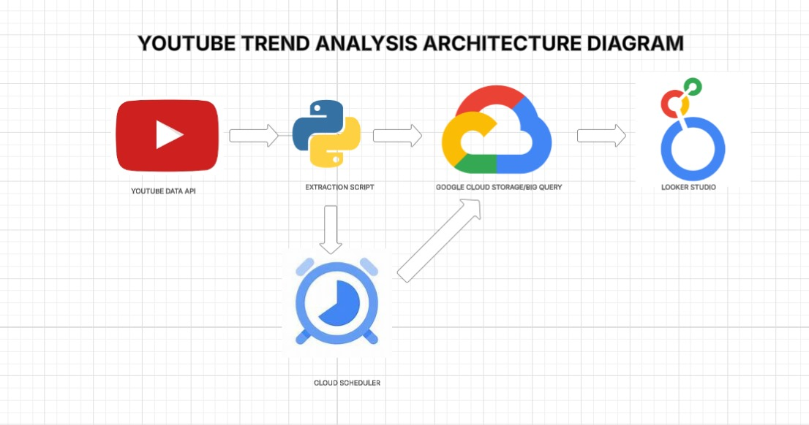

# YOUTUBE TREND ANALYTICS | MODERN DATA ENGINEERING GCP PROJECT

## INTRODUCTION
This project is about analyzing trending videos on YouTube using Google Cloud Platform (GCP). We use the YouTube Data API to collect real-time data about trending videos, including titles, views, likes, hashtags, and more. The collected data is then stored and processed using GCP tools like BigQuery and Cloud Storage. Finally, we create visual dashboards using Looker Studio to help users understand which videos and hashtags are trending on YouTube. This project is useful for anyone interested in learning how to work with APIs, cloud tools, and data visualization.

## ARCHITECTURE 

## TECHNOLOGIES USED
1. Programming Language - Python
2. Scripting Language - SQL
3. Google Cloud Platform
   - Big Query
   - Cloud Storage
   - Looker Studio
   - Compute engine
   - Cloud scheduler
4. YOUTUBE API (UNIQUE KEY FOR EACH | DO NOT SHARE PUBLICLY)

5. GETTING YOUR YOUTUBE API : https://developers.google.com/youtube/v3/getting-started

## SCRIPTS FOR PROJECT
1. PYTHON CODE [api-integration.py](https://github.com/THENNAVAN0605/Youtube-TREND-DATA-ENGINEERING-PROJECT/blob/main/api-integration.py)
2. SQL CODE 1 [top-hashtag.sql](https://github.com/THENNAVAN0605/Youtube-TREND-DATA-ENGINEERING-PROJECT/blob/main/top-hashtag.sql)
3. SQL CODE 2 [top-trendingvdo.sql](https://github.com/THENNAVAN0605/Youtube-TREND-DATA-ENGINEERING-PROJECT/blob/main/top-trendingvdo.sql)
4. BASH FILE [deploy.bash](https://github.com/THENNAVAN0605/Youtube-TREND-DATA-ENGINEERING-PROJECT/blob/main/deploy.bash)

## CONCLUSION
In this project, we successfully built a data pipeline that extracts trending video data from YouTube, processes and stores it using Google Cloud Platform, and visualizes insights using Looker Studio. This setup provides a real-time view of what’s popular on YouTube, helping users understand current trends, top hashtags, and high-performing content. It’s a great example of how cloud tools and public APIs can be combined to create powerful data-driven solutions, especially for learning and academic purposes.
